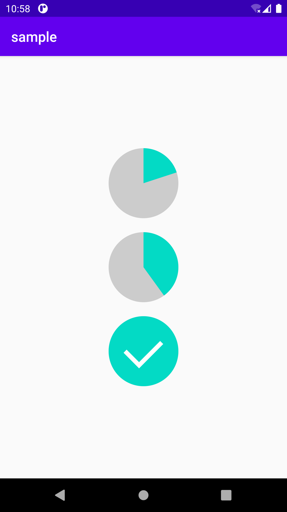

# ProgressPie
A pie progress with check.




## Prepare

Step 1. Add the JitPack repository to your root build file
```
repositories {
  ...
  maven { url 'https://jitpack.io' }
}
```

Step 2. Add the PieProgress dependency to your app build file
```
dependencies {
  implementation 'com.github.littlemozart:ProgressPie:1.0.0'
}
```
